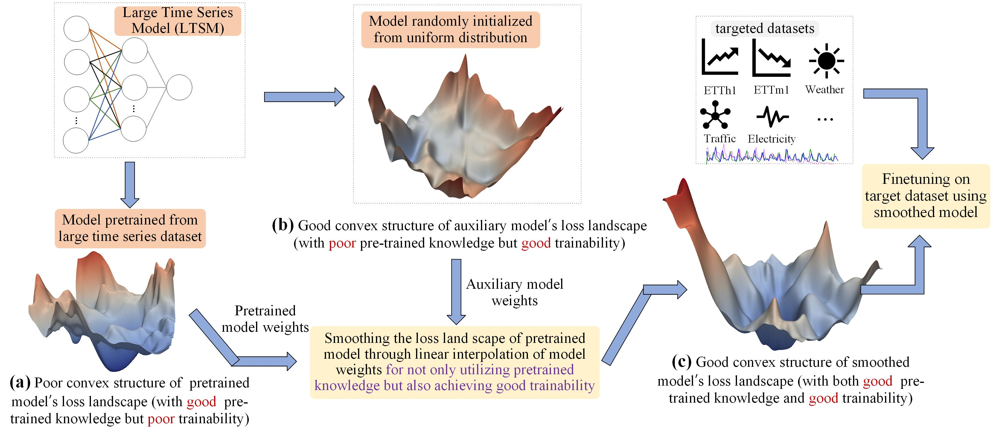

# SFF (Lost in the Non-convex Loss Landscape: How to Fine-tune the Large Time Series Model? Published in ICLR 2026)
Pytorch implementation of SFF.

## Overview



## Datasets
  The public datasets can be downloaded from https://drive.google.com/drive/folders/1PPLsAoDbv4WcoXDp-mm4LFxoKwewnKxX and place them in the datasets folder.

## Usage
Timer's pre-trained weights can be downloaded from the link https://drive.google.com/drive/folders/15oaiAl4OO5gFqZMJD2lOtX2fxHbpgcU8.

In the `run.py` script, different evaluation modes are enabled by setting `training_from_scratch` (TFS), `LP` (linear probing), `LPFF` (linear probing first then full fine-tuning) or `smoothed_full_finetuning`. If both are set to `False`, the original full fine-tuning (FF) strategy is adopted.


## Reference
If this repository and the work are helpful to you, please consider citing it:

```
@inproceedings{zhanglost,
  title={Lost in the Non-convex Loss Landscape: How to Fine-tune the Large Time Series Model?},
  author={Zhang, Xu and Wang, Peng and Wang, Wei},
  booktitle={The Fourteenth International Conference on Learning Representations}
}
```


  
